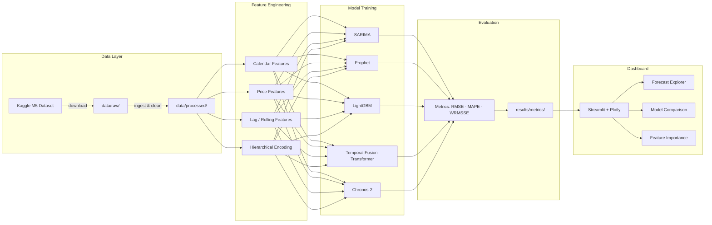

# Walmart M5 Demand Forecasting — Multi-Model Forecasting System

[](https://www.python.org/)
[](LICENSE)
[](https://streamlit.io/)
[](https://lightgbm.readthedocs.io/)
[](https://facebook.github.io/prophet/)
[](https://github.com/amazon-science/chronos-forecasting)

---

## Overview

An end-to-end demand forecasting system built on the **Walmart M5 Kaggle competition dataset** — one of the largest and most challenging retail forecasting benchmarks. The pipeline ingests **30,490 products** across **10 stores** spanning **1,941 days** of daily sales history, engineers rich temporal and hierarchical features, and trains **five diverse forecasting models** ranging from classical statistics to foundation models. An interactive **Streamlit dashboard** lets stakeholders explore predictions, compare model accuracy, and drill down by store, category, or individual SKU.

> **Why five models?** No single algorithm dominates every time series. By combining a classical SARIMA baseline, Meta's Prophet, a gradient-boosted tree (LightGBM), a deep-learning Temporal Fusion Transformer, and Amazon's pretrained Chronos-2 foundation model, this project quantifies the accuracy–complexity trade-off and provides an ensemble-ready toolkit for real-world retail forecasting.

---

## Architecture



---

## Dataset

| Property | Value |
|---|---|
| **Source** | [Walmart M5 Forecasting — Kaggle](https://www.kaggle.com/competitions/m5-forecasting-accuracy) |
| **Products** | 30,490 SKUs |
| **Stores** | 10 (CA, TX, WI) |
| **Time Span** | 1,941 days (Jan 2011 – Jun 2016) |
| **Granularity** | Daily unit sales |
| **Supplementary** | Calendar events, sell prices |

Download the dataset:

```bash
kaggle competitions download -c m5-forecasting-accuracy -p data/raw/
unzip data/raw/m5-forecasting-accuracy.zip -d data/raw/
```

---

## Models

| # | Model | Type | Description |
|---|---|---|---|
| 1 | **SARIMA** | Statistical | Seasonal ARIMA with automatic order selection via AIC grid search. Strong baseline for univariate series. |
| 2 | **Prophet** | Additive | Meta's decomposable model with built-in holiday effects, trend changepoints, and Fourier seasonality. |
| 3 | **LightGBM** | Gradient Boosting | Feature-rich tree ensemble leveraging lag features, rolling statistics, price, and calendar encodings. |
| 4 | **Temporal Fusion Transformer** | Deep Learning | Attention-based architecture (via NeuralForecast) that handles static covariates, known future inputs, and multi-horizon forecasting. |
| 5 | **Chronos-2** | Foundation Model | Amazon's pretrained time-series foundation model — zero-shot and fine-tuned forecasting without manual feature engineering. |

---

## Dashboard Preview

> Screenshots will be added after the dashboard is complete.

| View | Description |
|---|---|
| **Forecast Explorer** | Interactive time-series plot with model selector and confidence intervals |
| **Model Comparison** | Side-by-side accuracy metrics across all five models |
| **Feature Importance** | SHAP-based feature importance for LightGBM |
| **Store / Category Drilldown** | Hierarchical filters for store, department, and SKU |

---

## Installation & Setup

### Prerequisites

- Python 3.10 or higher
- pip / conda
- [Kaggle API credentials](https://www.kaggle.com/docs/api) (`~/.kaggle/kaggle.json`)

### 1. Clone the repository

```bash
git clone https://github.com/Mudit-R/demand-forecasting-walmart.git
cd demand-forecasting-walmart
```

### 2. Create a virtual environment

```bash
python -m venv .venv
# Windows
.venv\Scripts\activate
# macOS / Linux
source .venv/bin/activate
```

### 3. Install dependencies

```bash
pip install -r requirements.txt
```

### 4. Download the dataset

```bash
kaggle competitions download -c m5-forecasting-accuracy -p data/raw/
# Extract
cd data/raw && unzip m5-forecasting-accuracy.zip && cd ../..
```

---

## Usage

### Train models

```bash
# Run full training pipeline
python -m src.models.train_sarima
python -m src.models.train_prophet
python -m src.models.train_lightgbm
python -m src.models.train_tft
python -m src.models.train_chronos

# Or run all at once
python -m src.models.train_all
```

### Launch the dashboard

```bash
streamlit run dashboard/app.py
```

The dashboard will open at `http://localhost:8501`.

---

## Project Structure

```
demand-forecasting-walmart/
│
├── README.md                       # This file
├── LICENSE                         # MIT License
├── requirements.txt                # Python dependencies
├── setup.py                        # Package configuration
├── .gitignore                      # Git ignore rules
│
├── data/
│   ├── raw/                        # Original M5 CSV files (git-ignored)
│   └── processed/                  # Cleaned & feature-engineered data
│
├── notebooks/                      # Jupyter notebooks for EDA & prototyping
│
├── src/
│   ├── __init__.py
│   ├── data/
│   │   ├── __init__.py
│   │   ├── ingest.py               # Download & load raw data
│   │   └── preprocess.py           # Cleaning, melting, merging
│   ├── features/
│   │   ├── __init__.py
│   │   └── feature_engineering.py  # Lag, rolling, calendar, price features
│   ├── models/
│   │   ├── __init__.py
│   │   ├── train_sarima.py
│   │   ├── train_prophet.py
│   │   ├── train_lightgbm.py
│   │   ├── train_tft.py
│   │   ├── train_chronos.py
│   │   └── train_all.py
│   ├── evaluation/
│   │   ├── __init__.py
│   │   └── metrics.py              # RMSE, MAPE, WRMSSE calculations
│   └── utils/
│       ├── __init__.py
│       └── helpers.py              # Shared utilities & config
│
├── models/                         # Saved model artifacts (git-ignored)
│
├── results/
│   └── metrics/                    # Evaluation CSVs & plots
│
└── dashboard/
    ├── __init__.py
    ├── app.py                      # Streamlit entry point
    ├── components/
    │   ├── __init__.py
    │   ├── sidebar.py              # Filter controls
    │   ├── charts.py               # Plotly chart builders
    │   └── metrics_cards.py        # KPI cards
    └── pages/
        ├── forecast_explorer.py
        ├── model_comparison.py
        └── feature_importance.py
```

---

## Results

> *Results will be populated after model training.*

| Model | RMSE | MAPE (%) | WRMSSE | Training Time |
|---|---|---|---|---|
| SARIMA | — | — | — | — |
| Prophet | — | — | — | — |
| LightGBM | — | — | — | — |
| TFT | — | — | — | — |
| Chronos-2 | — | — | — | — |

---

## Tech Stack

| Layer | Technologies |
|---|---|
| **Language** | Python 3.10+ |
| **Data** | Pandas · NumPy · PyArrow |
| **Visualization** | Plotly · Matplotlib · Seaborn |
| **Dashboard** | Streamlit |
| **Classical Models** | Statsmodels (SARIMA) · Prophet |
| **ML Models** | LightGBM · XGBoost · Scikit-learn |
| **Deep Learning** | NeuralForecast (TFT) |
| **Foundation Model** | Amazon Chronos-2 |
| **Explainability** | SHAP |
| **Utilities** | tqdm · Joblib · Kaggle API |

---

## License

This project is licensed under the **MIT License** — see the [LICENSE](LICENSE) file for details.

---

## Author

**Mudit R**

- GitHub: [@Mudit-R](https://github.com/Mudit-R)

---

<p align="center">
  <i>Built with curiosity — if you find this useful, consider giving it a star</i>
</p>
