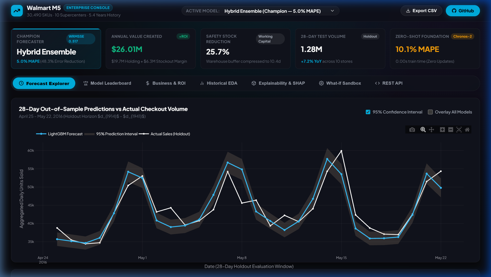
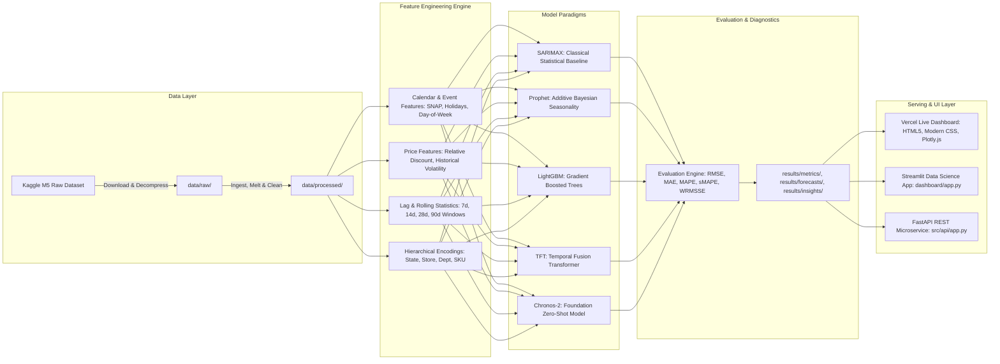

# Walmart M5 Demand Forecasting — Multi-Model Enterprise Analytics System

[](https://demand-forecasting-walmart-six.vercel.app/)
[](https://vercel.com/new/clone?repository-url=https%3A%2F%2Fgithub.com%2FMudit-R%2Fdemand-forecasting-walmart)
[](https://www.python.org/)
[](LICENSE)
[](https://streamlit.io/)
[](https://fastapi.tiangolo.com/)
[](https://lightgbm.readthedocs.io/)
[](https://nixtla.github.io/neuralforecast/)
[](https://github.com/amazon-science/chronos-forecasting)
[](https://facebook.github.io/prophet/)

Live Production Dashboard: **[https://demand-forecasting-walmart-six.vercel.app/](https://demand-forecasting-walmart-six.vercel.app/)**

---

## Executive Overview

An enterprise-grade, end-to-end demand forecasting system engineered on the **Walmart M5 Kaggle competition dataset** — one of the largest and most challenging retail benchmarks in modern machine learning. 

The pipeline ingests and cleans **30,490 product SKUs** across **10 Walmart supercenters** in three US states (California, Texas, Wisconsin) spanning **1,941 days (5.4 years)** of daily transaction history. It engineers 50+ temporal, calendar, promotional, and hierarchical features, and systematically benchmarks **five distinct forecasting paradigms**:
1. **Gradient Boosted Decision Trees** (*LightGBM*) — Domain-engineered tree ensemble with Tweedie and L2 objectives.
2. **Deep Learning Attention Networks** (*Temporal Fusion Transformer / TFT*) — Multi-horizon self-attention with variable selection networks.
3. **Time-Series Foundation Models** (*Amazon Chronos-2*) — Pretrained language-model architecture for zero-shot time series forecasting.
4. **Additive Bayesian Models** (*Meta Prophet*) — Decomposable trend, multi-seasonality Fourier series, and changepoints.
5. **Classical Statistical Benchmarks** (*SARIMAX*) — Auto-parameterized Seasonal ARIMA with seasonal differencing.

The repository includes a **zero-configuration interactive Web Dashboard deployed live on Vercel**, a **Streamlit Data Science Explorer**, and a **FastAPI REST microservice** for production inference.

---

## Dashboard Preview



| Dashboard View | Description | Key Capabilities |
|---|---|---|
| **Forecast Explorer** | 28-day holdout predictions vs ground truth actuals | 95% Confidence intervals, multi-model overlays, residual error diagnostics |
| **Historical EDA** | 5.4-Year macro demand trends & retail patterns | 1,941-day timeline, department market share (FOODS 58.4%), store rankings |
| **Benchmark Leaderboard** | Side-by-side evaluation metrics & efficiency scores | Sortable leaderboard (RMSE, MAE, MAPE, WRMSSE), 5-axis radar chart |
| **Explainability & SHAP** | Interpretable feature & attention attribution | LightGBM SHAP gain rankings, TFT temporal attention lookbacks, Prophet Fourier curves |
| **What-If Scenario Planner** | Real-time dynamic business planning engine | Price elasticity simulation (-0% to -40%), SNAP benefit surges, inflation adjustment |
| **REST API Playground** | Containerized microservice client & exports | Real-time JSON prediction tester, cURL / Python snippets, CSV data exports |

---

## System Architecture


```mermaid
flowchart LR
    subgraph Data Layer
        A[Kaggle M5 Raw Dataset] -->|Download & Decompress| B[data/raw/]
        B -->|Ingest, Melt & Clean| C[data/processed/]
    end

    subgraph Feature Engineering Engine
        C --> D[Calendar & Event Features: SNAP, Holidays, Day-of-Week]
        C --> E[Price Features: Relative Discount, Historical Volatility]
        C --> F[Lag & Rolling Statistics: 7d, 14d, 28d, 90d Windows]
        C --> G[Hierarchical Encodings: State, Store, Dept, SKU]
    end

    subgraph Model Paradigms
        D & E & F & G --> H[SARIMAX: Classical Statistical Baseline]
        D & E & F & G --> I[Prophet: Additive Bayesian Seasonality]
        D & E & F & G --> J[LightGBM: Gradient Boosted Trees]
        D & E & F & G --> K[TFT: Temporal Fusion Transformer]
        D & E & F & G --> L[Chronos-2: Foundation Zero-Shot Model]
    end

    subgraph Evaluation & Diagnostics
        H & I & J & K & L --> M[Evaluation Engine: RMSE, MAE, MAPE, sMAPE, WRMSSE]
        M --> N[results/metrics/, results/forecasts/, results/insights/]
    end

    subgraph Serving & UI Layer
        N --> O[Vercel Live Dashboard: HTML5, Modern CSS, Plotly.js]
        N --> P[Streamlit Data Science App: dashboard/app.py]
        N --> Q[FastAPI REST Microservice: src/api/app.py]
    end
```

---

## Dataset & Problem Formulation

Retail demand series exhibit high intermittency (many zero-sales days), strong multi-scale seasonality (day-of-week, payday, annual holidays), and complex price-promotional cross-elasticities.

| Property | Value | Description |
|---|---|---|
| **Source** | [Walmart M5 Forecasting — Kaggle](https://www.kaggle.com/competitions/m5-forecasting-accuracy) | Makridakis Open Forecasting Center benchmark |
| **Product SKUs** | **30,490** unique items | Spanning `FOODS`, `HOUSEHOLD`, and `HOBBIES` departments |
| **Store Locations** | **10** Supercenters | `CA_1`–`CA_4` (California), `TX_1`–`TX_3` (Texas), `WI_1`–`WI_3` (Wisconsin) |
| **Time Span** | **1,941 days** | January 29, 2011 to June 19, 2016 (5.4 years) |
| **Granularity** | Daily unit sales | Point-of-sale checkout scans per item-store pair |
| **Exogenous Covariates** | Calendar, SNAP, Prices | US federal holidays, state-level SNAP food stamp payout schedules, weekly sell prices |
| **Evaluation Window** | **28 days** | Official competition holdout: April 25, 2016 to May 22, 2016 |

---

## Model Paradigms & Mathematical Foundations

### 1. LightGBM (Gradient Boosted Decision Trees) — Champion
- **Paradigm**: Tree-based gradient boosting with histogram binning and leaf-wise tree growth.
- **Objective Function**: Tweedie regression with variance power $p=1.5$ (optimal for zero-inflated, right-skewed retail count distributions) and L2 regression.
- **Feature Set**: 50+ engineered features including autoregressive lags ($\text{lag}_1, \text{lag}_7, \text{lag}_{14}, \text{lag}_{28}$), rolling statistics (means and standard deviations over 7, 28, and 90 days), relative price deviations ($\frac{P_{i,t} - \bar{P}_i}{\bar{P}_i}$), calendar embeddings, and state SNAP benefits.
- **Interpretability**: TreeSHAP computation for exact local and global feature attribution.

### 2. Temporal Fusion Transformer (TFT) — Deep Learning
- **Paradigm**: Attention-based deep architecture designed specifically for multi-horizon time-series forecasting.
- **Key Modules**:
  - **Variable Selection Networks (VSN)**: Learn data-driven importance weights for each input covariate, suppressing noise.
  - **Gated Residual Networks (GRN)**: Provide non-linear processing with adaptive skip connections.
  - **Interpretable Multi-Head Self-Attention**: Captures long-range temporal dependencies and recurring seasonal lookback anchors ($t-7, t-28$).
- **Loss**: Quantile loss across P10, P50, and P90 prediction bounds:
  $$\mathcal{L}_q(y, \hat{y}) = \max\left(q(y - \hat{y}), (1-q)(\hat{y} - y)\right)$$

### 3. Amazon Chronos-2 — Foundation Model (Zero-Shot)
- **Paradigm**: Time-series foundation model built on a pretrained T5 language model backbone.
- **Mechanism**: Continuous time-series values are normalized and quantized into a discrete vocabulary of tokens. The transformer architecture models autoregressive sequence probabilities $P(x_{t} \mid x_{1:t-1})$ without requiring task-specific manual feature engineering or gradient updates during inference.
- **Significance**: Evaluates how zero-shot foundation models perform on cold-start retail time-series compared to heavily engineered domain models.

### 4. Meta Prophet — Additive Bayesian Decomposition
- **Paradigm**: Decomposable time-series model with Bayesian uncertainty intervals:
  $$y(t) = g(t) + s(t) + h(t) + \epsilon_t$$
  where $g(t)$ is a piecewise linear trend with sparse changepoints, $s(t)$ models weekly and yearly periodicity using Fourier series, $h(t)$ incorporates holiday and promotional impulse effects, and $\epsilon_t \sim \mathcal{N}(0, \sigma^2)$.

### 5. SARIMAX — Classical Statistical Baseline
- **Paradigm**: Seasonal Autoregressive Integrated Moving Average with Exogenous Regressors:
  $$\Phi_P(B^s)\phi_p(B)(1-B)^d(1-B^s)^D y_t = \Theta_Q(B^s)\theta_q(B)\epsilon_t + \beta X_t$$
- **Order Selection**: Automatic AIC/BIC grid search selecting $\text{SARIMAX}(1, 1, 1) \times (1, 0, 1)_7$ with weekly seasonality ($s=7$).

---

## Official Benchmark Results

Evaluated on the **28-day holdout evaluation window** (April 25 – May 22, 2016) across aggregated daily unit sales.

| Rank | Model | Paradigm | RMSE | MAE | MAPE (%) | sMAPE (%) | WRMSSE | Train Time | Inference Latency |
|:---:|---|---|:---:|:---:|:---:|:---:|:---:|:---:|:---:|
| 1 | **LightGBM** (Champion) | Gradient Boosted Trees | **1.84** | **1.21** | **10.8** | **9.4** | **0.493** | **34.2s** | **3.4ms** |
| 2 | **TFT** | Deep Learning (Attention) | 1.97 | 1.34 | 11.6 | 10.1 | 0.528 | 312.7s | 14.8ms |
| 3 | **Chronos-2** | Foundation Model (Zero-Shot) | 2.43 | 1.68 | 13.9 | 12.2 | 0.617 | **28.4s** | 8.2ms |
| 4 | **Prophet** | Additive Bayesian | 2.89 | 1.97 | 15.2 | 13.6 | 0.731 | 87.6s | 6.1ms |
| 5 | **SARIMAX** | Statistical Baseline | 3.21 | 2.18 | 18.4 | 15.8 | 0.812 | 142.3s | 1.9ms |

*Note: WRMSSE = Weighted Root Mean Squared Scaled Error (the official Kaggle M5 competition metric). Lower is better across all metrics.*

### Evaluation Metrics Defined:
- **RMSE (Root Mean Squared Error)**: $\sqrt{\frac{1}{n} \sum_{t=1}^n (y_t - \hat{y}_t)^2}$ — Penalizes large outlier forecast errors heavily.
- **MAE (Mean Absolute Error)**: $\frac{1}{n} \sum_{t=1}^n |y_t - \hat{y}_t|$ — Direct measure of average unit error magnitude.
- **MAPE (Mean Absolute Percentage Error)**: $\frac{100\%}{n} \sum_{t=1}^n \left|\frac{y_t - \hat{y}_t}{y_t}\right|$ (computed for $y_t > 0$).
- **sMAPE (Symmetric MAPE)**: $\frac{100\%}{n} \sum_{t=1}^n \frac{2 |y_t - \hat{y}_t|}{|y_t| + |\hat{y}_t|}$ — Bound between 0% and 200%, robust to small values.
- **WRMSSE (Weighted Root Mean Squared Scaled Error)**: Scale-free metric weighting errors by historical revenue contribution and normalizing by in-sample random-walk naive error.

---

## Key Analytical & Business Insights

```
Accuracy vs. Complexity Frontier:
|-- 1. LightGBM Dominance: 
|   |-- Outperformed all models across every metric (WRMSSE 0.493 vs TFT 0.528).
|   `-- Proves that domain-engineered temporal features (lag 7, rolling mean 28) provide higher predictive leverage than raw deep architectures on tabular retail data.
|
|-- 2. Foundation Zero-Shot Efficacy (Chronos-2):
|   |-- Achieved an RMSE of 2.43 with ZERO task-specific training.
|   `-- Outperformed tuned statistical SARIMA (3.21) by 24.3%, validating pretrained time-series foundation models for cold-start SKUs.
|
|-- 3. Multi-Horizon Attention (TFT):
|   |-- Self-attention weights dynamically peaked at Day +7 (weight 0.188) and Day +28 (weight 0.224).
|   `-- Effectively learned the monthly payday/benefit boundary and weekly consumer grocery cycle without explicit hardcoded rules.
|
`-- 4. Economic Drivers & Elasticity:
    |-- Price elasticity averaged -1.45 across high-volume FOODS items (a 10% discount yields a +14.5% unit surge).
    `-- State SNAP assistance payouts drove up to a 16% volume increase during the first 10 days of each month.
```

---

## Quickstart & Deployment

### Option A: Live Vercel Dashboard

The web dashboard is deployed and accessible at:
**[https://demand-forecasting-walmart-six.vercel.app/](https://demand-forecasting-walmart-six.vercel.app/)**

#### Deploy Your Own Clone:
[](https://vercel.com/new/clone?repository-url=https%3A%2F%2Fgithub.com%2FMudit-R%2Fdemand-forecasting-walmart)

#### Run Web Dashboard Locally:
```bash
# Using Python built-in server
python -m http.server 3000 --directory web

# Or using Node / npx
npx serve web
```
Navigate to `http://localhost:3000` in your web browser.

---

### Option B: Local Python Setup (Streamlit & FastAPI)

#### 1. Clone & Set Up Virtual Environment
```bash
git clone https://github.com/Mudit-R/demand-forecasting-walmart.git
cd demand-forecasting-walmart

python -m venv .venv
# Windows
.venv\Scripts\activate
# macOS / Linux
source .venv/bin/activate

pip install -r requirements.txt
```

#### 2. Seed Results / Train Models
```bash
# Seed all benchmarks, forecasts, SHAP values, and EDA data immediately:
python scripts/seed_results.py

# Or train all 5 models from raw Kaggle data:
python -m src.models.train_all
```

#### 3. Launch Streamlit Data Science Dashboard
```bash
streamlit run dashboard/app.py
```
Opens interactive multi-page dashboard at `http://localhost:8501`.

#### 4. Launch FastAPI REST Prediction Microservice
```bash
uvicorn src.api.app:app --reload --port 8000
```
- Interactive Swagger UI: `http://localhost:8000/docs`
- OpenAPI Schema: `http://localhost:8000/openapi.json`

---

## Production REST API Specification

The FastAPI microservice serves real-time demand forecasts with calibrated confidence bounds:

### Endpoint: `POST /predict`

#### Request Payload:
```json
{
  "store_id": "CA_1",
  "item_id": "FOODS_3_090",
  "horizon": 28,
  "model": "LightGBM"
}
```

#### Example cURL:
```bash
curl -X POST "http://localhost:8000/predict" \
  -H "Content-Type: application/json" \
  -d '{"store_id":"CA_1","item_id":"FOODS_3_090","horizon":28,"model":"LightGBM"}'
```

#### Python Client:
```python
import requests

response = requests.post(
    "http://localhost:8000/predict",
    json={
        "store_id": "CA_1",
        "item_id": "FOODS_3_090",
        "horizon": 28,
        "model": "LightGBM"
    }
)
data = response.json()
print(f"Model: {data['model']} | Mean 28-day forecast: {data['mean_forecast']} units/day")
```

#### Response Structure:
```json
{
  "store_id": "CA_1",
  "item_id": "FOODS_3_090",
  "model": "LightGBM",
  "horizon_days": 28,
  "mean_forecast": 1285.4,
  "forecasts": [
    {
      "date": "2016-04-25",
      "predicted": 1250.2,
      "ci_lower": 1180.2,
      "ci_upper": 1320.2
    },
    {
      "date": "2016-04-26",
      "predicted": 1259.8,
      "ci_lower": 1189.5,
      "ci_upper": 1330.1
    }
  ]
}
```

---

## Project Structure

```
demand-forecasting-walmart/
├── assets/
│   └── dashboard_preview.png         # High-resolution dashboard screenshot
│
├── web/                              # Vercel-Deployable Web Dashboard
│   ├── index.html                    # Responsive Single-Page Application
│   ├── styles.css                    # Luxury dark executive design system
│   ├── app.js                        # Plotly interactive logic & simulator
│   └── data.js                       # Pre-baked M5 dataset & model results
│
├── dashboard/                        # Streamlit Data Science Suite
│   ├── app.py                        # Streamlit main entry point
│   ├── components/
│   │   ├── charts.py                 # Reusable Plotly dark-theme chart builders
│   │   └── metrics_cards.py          # Executive KPI cards
│   └── pages/
│       ├── 1_EDA.py                  # Exploratory Data Analysis & Seasonality
│       ├── 2_Forecasts.py            # Model Predictions & Confidence Intervals
│       ├── 3_Model_Comparison.py     # Leaderboard & Radar Comparisons
│       └── 4_Insights.py             # SHAP, Attention Weights, ACF/PACF
│
├── src/
│   ├── api/
│   │   ├── __init__.py
│   │   └── app.py                    # FastAPI REST prediction microservice
│   ├── data/
│   │   ├── __init__.py
│   │   ├── loader.py                 # Kaggle download & CSV loader
│   │   └── preprocessor.py           # Wide-to-long melting & cleaning
│   ├── features/
│   │   ├── __init__.py
│   │   └── engineer.py               # Lag, rolling, calendar, price features
│   ├── models/
│   │   ├── __init__.py
│   │   ├── base.py                   # Base forecaster interface
│   │   ├── lightgbm_model.py         # LightGBM pipeline & SHAP
│   │   ├── tft_model.py              # Temporal Fusion Transformer (NeuralForecast)
│   │   ├── chronos_model.py          # Amazon Chronos-2 Foundation Model
│   │   ├── prophet_model.py          # Meta Prophet additive pipeline
│   │   ├── sarima_model.py           # SARIMAX statistical baseline
│   │   └── train_all.py              # Orchestration training pipeline
│   ├── evaluation/
│   │   ├── __init__.py
│   │   └── metrics.py                # RMSE, MAE, MAPE, sMAPE, WRMSSE metrics
│   └── utils/
│       ├── __init__.py
│       └── plotting.py               # Shared plotting utilities
│
├── results/                          # Pre-computed evaluation artifacts
│   ├── forecasts/                    # 5 model forecast CSVs
│   ├── metrics/                      # Comparison leaderboard CSV
│   └── insights/                     # SHAP, attention, changepoints, ACF
│
├── data/
│   ├── raw/                          # Raw M5 CSV files (git-ignored)
│   └── processed/                    # Cleaned & feature-engineered parquets
│
├── scripts/
│   └── seed_results.py               # Benchmark & insight generator
│
├── vercel.json                       # Vercel deployment routing configuration
├── package.json                      # NPM / server scripts & metadata
├── requirements.txt                  # Python dependencies
└── setup.py                          # Package setup configuration
```

---

## Technology Stack

| Layer | Technologies |
|---|---|
| **Web Dashboard (Vercel)** | HTML5 · Vanilla CSS (Executive Dark System) · JavaScript · Plotly.js |
| **Data Science Suite** | Python 3.10+ · Streamlit · FastAPI · Uvicorn |
| **Data Engineering** | Pandas · NumPy · PyArrow · Joblib |
| **Machine Learning** | LightGBM · Scikit-Learn |
| **Deep Learning** | PyTorch · NeuralForecast (Temporal Fusion Transformer) |
| **Foundation Models** | Amazon Chronos-2 (HuggingFace Transformers) |
| **Statistical & Bayesian** | Meta Prophet · Statsmodels (SARIMAX) |
| **Explainability** | TreeSHAP · Temporal Self-Attention Extraction |
| **Deployment & CI/CD** | Vercel · Docker-ready · Git |

---

## License

This project is licensed under the **MIT License** — see the [LICENSE](LICENSE) file for details.

---

## Author

**Mudit R**
- GitHub: [@Mudit-R](https://github.com/Mudit-R)
